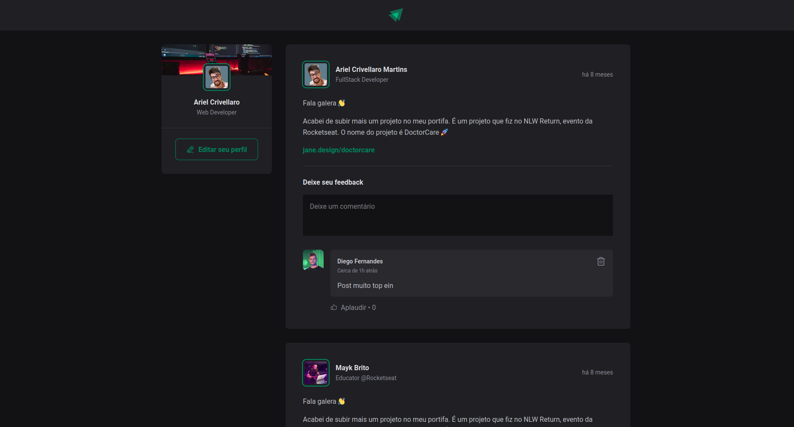

<h1>
  
</h1>

# Indice

- [Sobre](#-sobre)
- [Tecnologias utilizadas](#-tecnologias-utilizadas)
- [Como baixar o projeto](#-como-baixar-o-projeto)

---

## 🧾Sobre

O Projeto **IGNITE-FEED** é uma rede social onde devs podem publicar e comentar sobre tecnologia. O sistema foi desenvolvido durante o **Bootcamp Ignite** da RocketSeat com a finalidade de aplicarmos os conhecimentos estudados.

---

## 🛠Tecnologias utilizadas

O Projeto foi desenvolvido utilizando as seguintes tecnologias

- [Reactjs](https://reactjs.org)
- [Vite](https://vitejs.dev/)

---

## 💾 Como baixar o projeto

```bash

# Clonar o Repositório
$ git clone https://github.com/ArielCrivellaro/ignite-feed.git

# Entrar no Repositório
$ cd ignite-feed

# Instalar as dependências
$ yarn

# Iniciar o Projeto
$ yarn dev

```

---

### Desenvolvido por Ariel Crivellaro Martins 😎
